<!DOCTYPE html>
<html lang="en">

<head>
<meta charset="UTF-8">
<meta name="viewport" content="width=device-width, initial-scale=1.0">

<title>Gifts by Anna | Custom Resin Art & Gifts</title>
<link rel="stylesheet" href="style.css">

</head>

<body>

<nav>
    
Gifts by Anna

    

        <a href="#resin">Resin</a>
        <a href="#gifts">Gifts</a>
        <a href="#contact">Contact</a>
    

</nav>

<section class="hero">
    <h1>Uniquely Yours. Uniquely Anna.</h1>
    
Customized resin art and personalized gifts.

    <a href="#contact" class="hero-btn">Order Now</a>
</section>

<section id="resin" class="section">
    <h2 class="section-title">Resin Art</h2>
    

        

            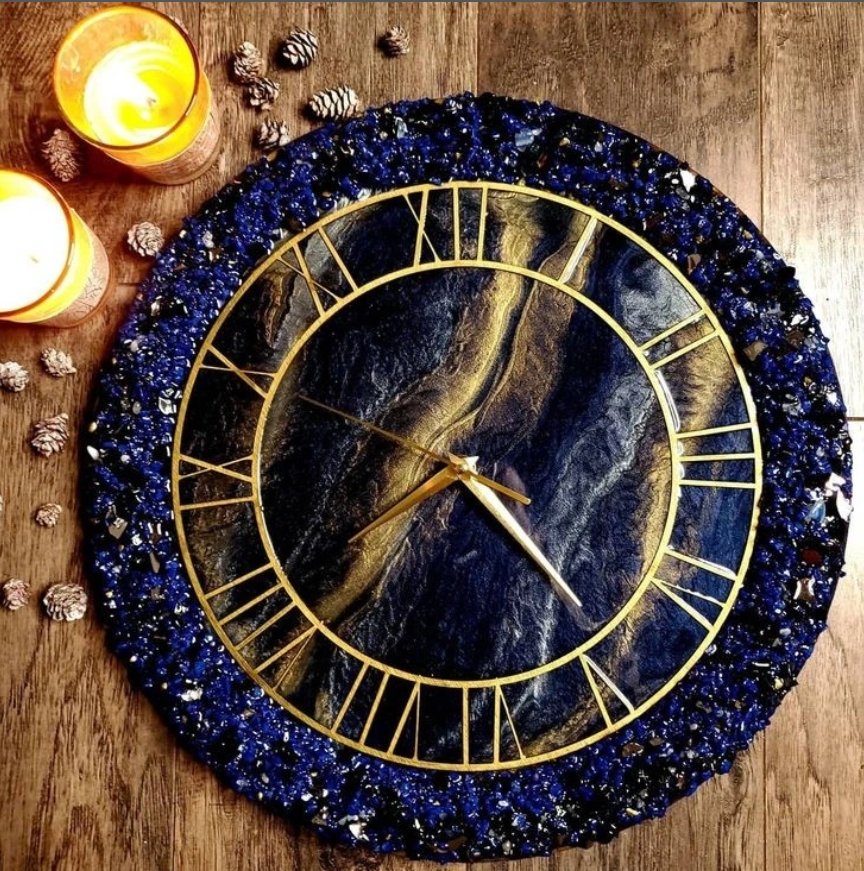
            
<h3>Wall Clock</h3>

        

        

            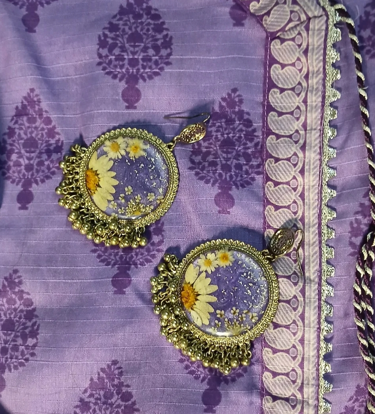
            
<h3>Jhumkas</h3>

        

        

            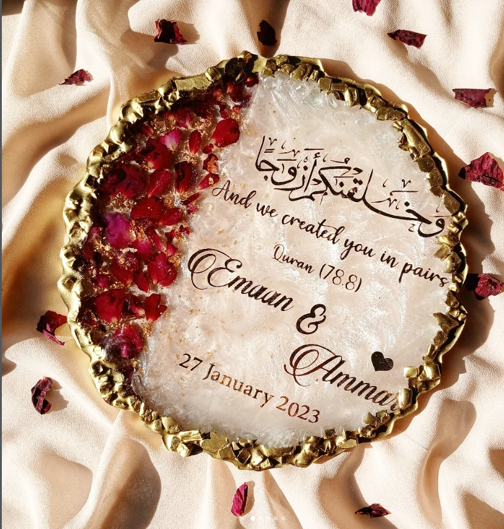
            
<h3>Wedding Plate</h3>

        

        

            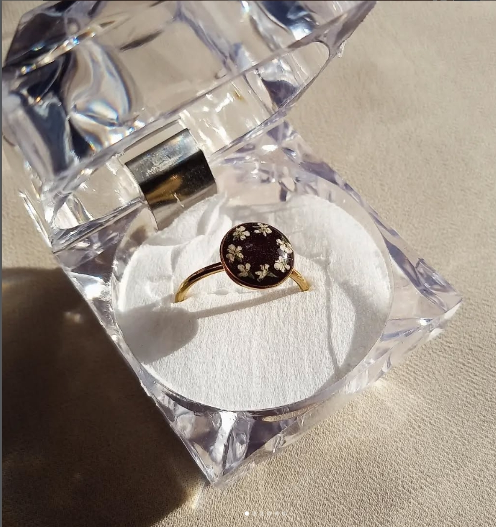
            
<h3> Rings</h3>

        

        

            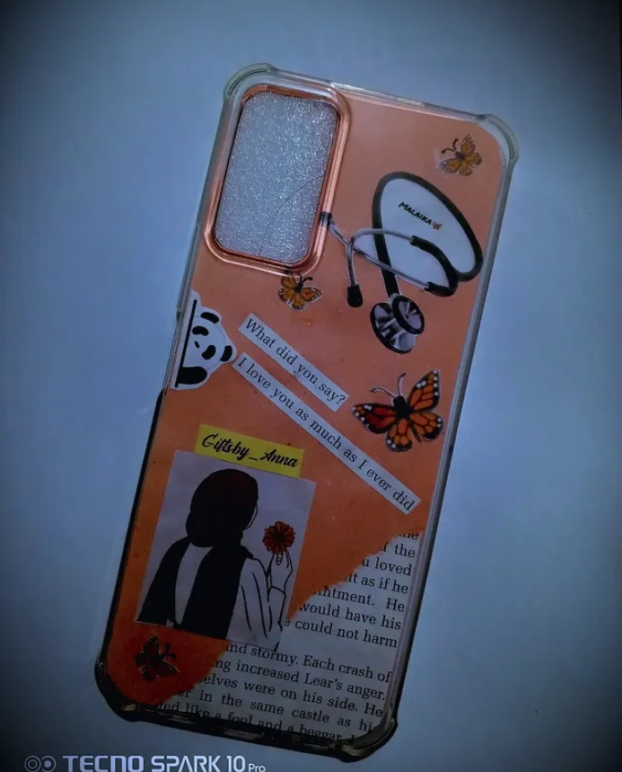
            
<h3>Phone Case</h3>

        

        

            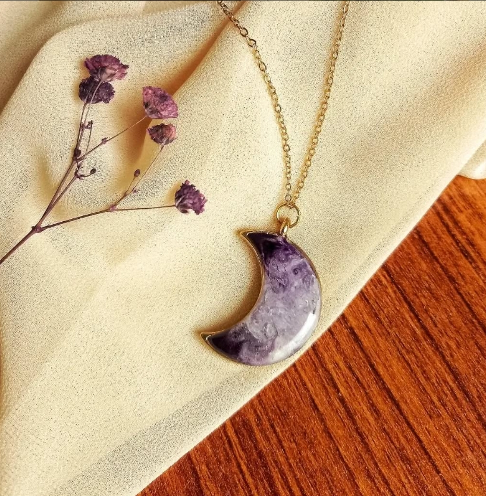
            
<h3>Lockets</h3>

        

        

            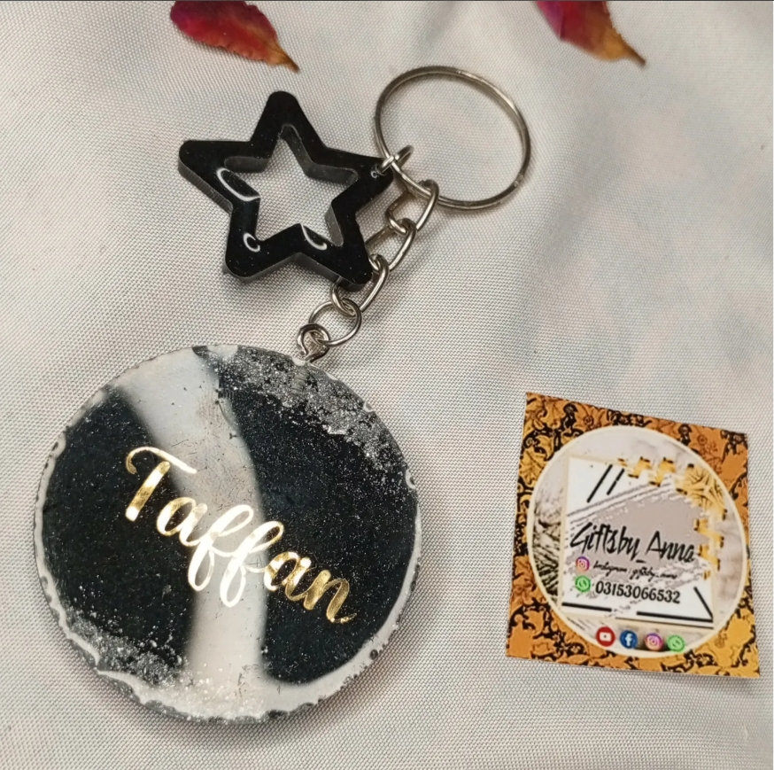
            
<h3>Keychains</h3>

        

    

</section>

<section id="gifts" class="section">
    <h2 class="section-title">General Gifts</h2>
    

        

            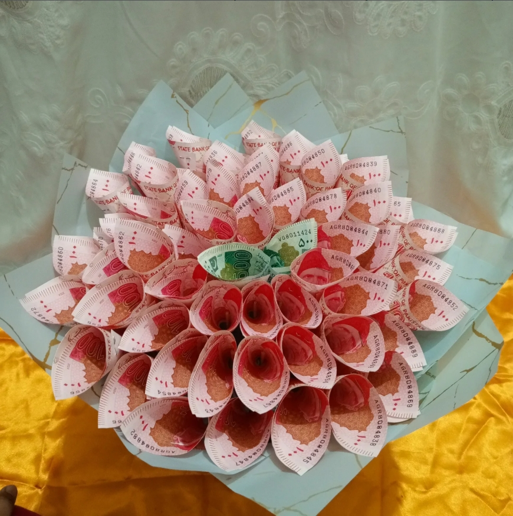
            
<h3>Bouquets</h3>

        

        

            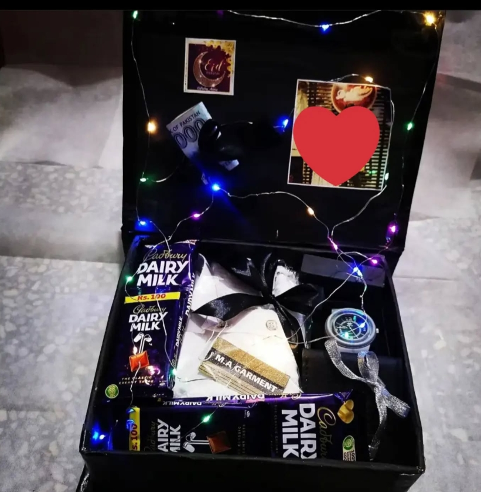
            
<h3>Gift Boxes</h3>

        

        

            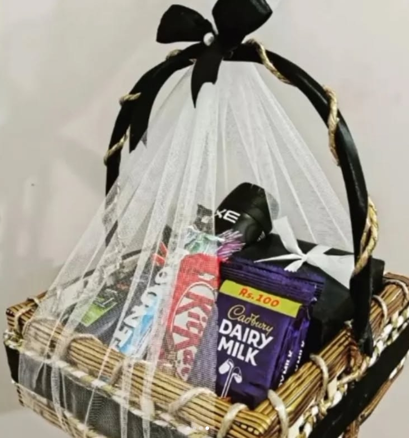
            
<h3>Gift Basket</h3>

        

        

            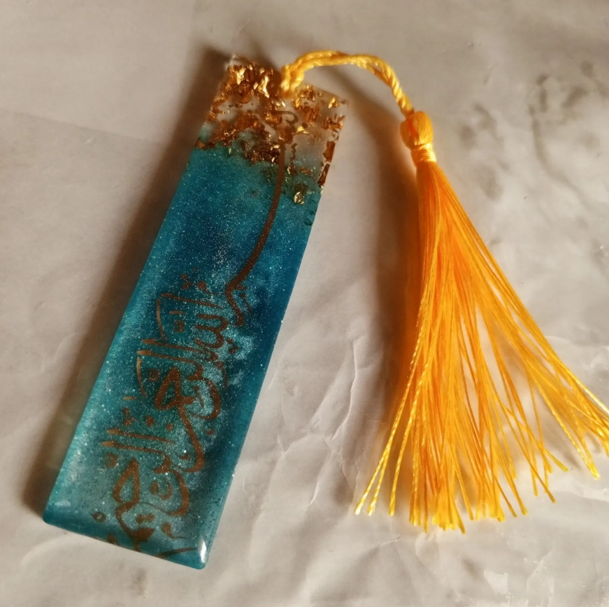
            
<h3>Bookmark</h3>

        

        

            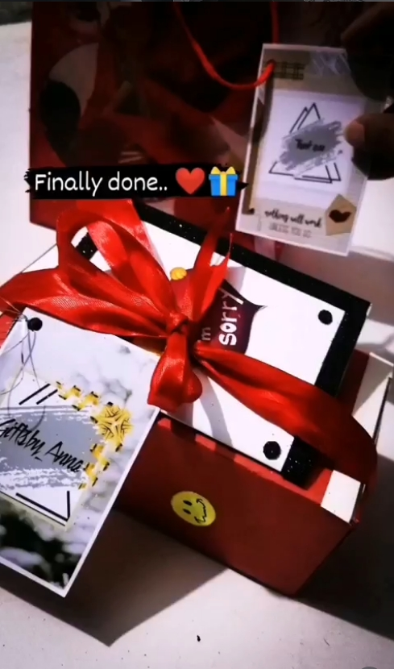
            
<h3>Sorry Box</h3>

        

        

            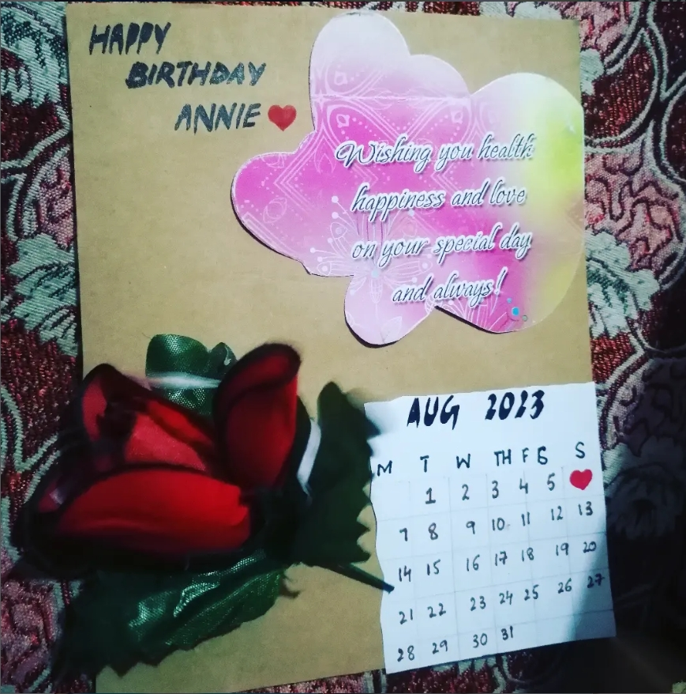
            
<h3>Birthday Cards</h3>

        

    

</section>

<footer id="contact">
    <h3>Contact Us</h3>
    
Email: qulain215@gmail.com

    
WhatsApp: 03153066532

    <a href="https://wa.me/923153066532" class="whatsapp-btn">Chat on WhatsApp</a>
</footer>

</body>
</html>
